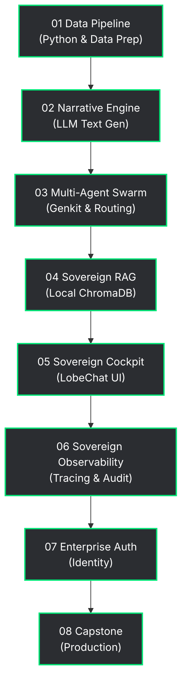

# 🚀 AI Bootcamps: Learning Velocity Sovereign

Welcome to the **Learning Velocity** AI curriculum. This repository trains enterprise engineers in advanced Applied AI patterns, from basic data pipelines all the way up to specialized Multi-Agent (Swarm) architecture and Local RAG.

Everything runs locally and securely within this Codespace.

---

## 🗺️ The Learning Journey

The curriculum moves sequentially through 8 tiers of complexity.

```mermaid
flowchart TD
    %% Styling
    classDef default fill:#1E1E1E,stroke:#4A90E2,stroke-width:2px,color:#FFFFFF,font-family:Inter;
    classDef active fill:#2b2d31,stroke:#00E676,stroke-width:2px,color:#FFFFFF;
    classDef future fill:#1A1A1A,stroke:#555555,stroke-width:1px,color:#888888,stroke-dasharray: 4 4;
    
    A["01 Data Pipeline<br>(Python & Data Prep)"]:::active --> B["02 Narrative Engine<br>(LLM Text Gen)"]:::active
    B --> C["03 Multi-Agent Swarm<br>(Genkit & Routing)"]:::active
    C --> D["04 Sovereign RAG<br>(Local ChromaDB)"]:::active
    D --> E["05 Sovereign Cockpit<br>(LobeChat UI)"]:::active
    E --> F["06 Sovereign Observability<br>(Tracing & Audit)"]:::active
    F --> G["07 Enterprise Auth<br>(Identity)"]:::active
    G --> H["08 Capstone<br>(Production)"]:::active
```

---

## 🏢 Curriculum Hub: The Multi-Domain Matrix

Instead of generic examples, you learn by solving problems in your specific industry. Choose your track below or navigate via the 5x8 Matrix.

### Track Syllabuses
* 🏦 [**Finance Track (Set A)**](curriculum_tracks/finance_track.md)
* 🏥 [**Healthcare Track (Set B)**](curriculum_tracks/healthcare_track.md)
* 📦 [**Supply Chain Track (Set C)**](curriculum_tracks/supply_chain_track.md)
* 🎓 [**EdTech Track (Set D)**](curriculum_tracks/edtech_track.md)
* ⚖️ [**Legal Track (Set E)**](curriculum_tracks/legal_track.md)

### Specific Lab Manuals

| Session | 🏦 Finance (Set A) | 🏥 Healthcare (Set B) | 📦 Supply Chain (Set C) | 🎓 EdTech (Set D) | ⚖️ Legal (Set E) |
| :--- | :--- | :--- | :--- | :--- | :--- |
| **01 Pipeline** | [Navigator](track_1_navigator/session_01/set_a_finance/01_finance_lab_guide.md) [Builder](01_data_pipeline_automation/01_data_pipeline_automation.md) [Architect](01_data_pipeline_automation/01_data_pipeline_automation.md) | [Navigator](track_1_navigator/session_01/set_b_healthcare/01_healthcare_lab_guide.md) [Builder](01_data_pipeline_automation/set_b_healthcare/01_healthcare_pipeline.md) [Architect](01_data_pipeline_automation/set_b_healthcare/01_healthcare_pipeline.md) | [Navigator](track_1_navigator/session_01/set_c_supply_chain/01_supply_chain_lab_guide.md) [Builder](01_data_pipeline_automation/set_c_supply_chain/01_supply_chain_pipeline.md) [Architect](01_data_pipeline_automation/set_c_supply_chain/01_supply_chain_pipeline.md) | [Navigator](track_1_navigator/session_01/set_d_edtech/01_edtech_lab_guide.md) [Builder](01_data_pipeline_automation/set_d_edtech/01_edtech_pipeline.md) [Architect](01_data_pipeline_automation/set_d_edtech/01_edtech_pipeline.md) | [Navigator](track_1_navigator/session_01/set_e_legal/01_legal_lab_guide.md) [Builder](01_data_pipeline_automation/set_e_legal/01_legal_pipeline.md) [Architect](01_data_pipeline_automation/set_e_legal/01_legal_pipeline.md) |
| **02 Narrative** | [Navigator](track_1_navigator/session_02/set_a_finance/02_finance_lab_guide.md) [Builder](02_executive_narrative_engine/02_executive_narrative_engine.md) [Architect](02_executive_narrative_engine/02_executive_narrative_engine.md) | [Navigator](track_1_navigator/session_02/set_b_healthcare/02_healthcare_lab_guide.md) [Builder](02_executive_narrative_engine/set_b_healthcare/02_healthcare_narrative.md) [Architect](02_executive_narrative_engine/set_b_healthcare/02_healthcare_narrative.md) | [Navigator](track_1_navigator/session_02/set_c_supply_chain/02_supply_chain_lab_guide.md) [Builder](02_executive_narrative_engine/set_c_supply_chain/02_supply_chain_narrative.md) [Architect](02_executive_narrative_engine/set_c_supply_chain/02_supply_chain_narrative.md) | [Navigator](track_1_navigator/session_02/set_d_edtech/02_edtech_lab_guide.md) [Builder](02_executive_narrative_engine/set_d_edtech/02_edtech_narrative.md) [Architect](02_executive_narrative_engine/set_d_edtech/02_edtech_narrative.md) | [Navigator](track_1_navigator/session_02/set_e_legal/02_legal_lab_guide.md) [Builder](02_executive_narrative_engine/set_e_legal/02_legal_narrative.md) [Architect](02_executive_narrative_engine/set_e_legal/02_legal_narrative.md) |
| **03 Swarm** | [Navigator](track_1_navigator/session_03/set_a_finance/03_finance_lab_guide.md) [Builder](03_multi_agent_systems/set_a_finance/03_finance_swarm.md) [Architect](03_multi_agent_systems/set_a_finance/03_finance_swarm.md) | [Navigator](track_1_navigator/session_03/set_b_healthcare/03_healthcare_lab_guide.md) [Builder](03_multi_agent_systems/set_b_healthcare/03_healthcare_swarm.md) [Architect](03_multi_agent_systems/set_b_healthcare/03_healthcare_swarm.md) | [Navigator](track_1_navigator/session_03/set_c_supply_chain/03_supply_chain_lab_guide.md) [Builder](03_multi_agent_systems/set_c_supply_chain/03_supply_chain_swarm.md) [Architect](03_multi_agent_systems/set_c_supply_chain/03_supply_chain_swarm.md) | [Navigator](track_1_navigator/session_03/set_d_edtech/03_edtech_lab_guide.md) [Builder](03_multi_agent_systems/set_d_edtech/03_edtech_swarm.md) [Architect](03_multi_agent_systems/set_d_edtech/03_edtech_swarm.md) | [Navigator](track_1_navigator/session_03/set_e_legal/03_legal_lab_guide.md) [Builder](03_multi_agent_systems/set_e_legal/03_legal_swarm.md) [Architect](03_multi_agent_systems/set_e_legal/03_legal_swarm.md) |
| **04 RAG** | [Navigator](track_1_navigator/session_04/set_a_finance/04_finance_lab_guide.md) [Builder](04_sovereign_knowledge_rag/set_a_finance/04_finance_rag.md) [Architect](04_sovereign_knowledge_rag/set_a_finance/04_finance_rag.md) | [Navigator](track_1_navigator/session_04/set_b_healthcare/04_healthcare_lab_guide.md) [Builder](04_sovereign_knowledge_rag/set_b_healthcare/04_healthcare_rag.md) [Architect](04_sovereign_knowledge_rag/set_b_healthcare/04_healthcare_rag.md) | [Navigator](track_1_navigator/session_04/set_c_supply_chain/04_supply_chain_lab_guide.md) [Builder](04_sovereign_knowledge_rag/set_c_supply_chain/04_supply_chain_rag.md) [Architect](04_sovereign_knowledge_rag/set_c_supply_chain/04_supply_chain_rag.md) | [Navigator](track_1_navigator/session_04/set_d_edtech/04_edtech_lab_guide.md) [Builder](04_sovereign_knowledge_rag/set_d_edtech/04_edtech_rag.md) [Architect](04_sovereign_knowledge_rag/set_d_edtech/04_edtech_rag.md) | [Navigator](track_1_navigator/session_04/set_e_legal/04_legal_lab_guide.md) [Builder](04_sovereign_knowledge_rag/set_e_legal/04_legal_rag.md) [Architect](04_sovereign_knowledge_rag/set_e_legal/04_legal_rag.md) |
| **05 Cockpit UI** | [Navigator](track_1_navigator/session_05/set_a_finance/05_finance_lab_guide.md) [Builder](05_advanced_ui_lobechat/05_advanced_ui_lobechat.md) [Architect](05_advanced_ui_lobechat/05_advanced_ui_lobechat.md) | [Navigator](track_1_navigator/session_05/set_b_healthcare/05_healthcare_lab_guide.md) [Builder](05_advanced_ui_lobechat/05_advanced_ui_lobechat.md) [Architect](05_advanced_ui_lobechat/05_advanced_ui_lobechat.md) | [Navigator](track_1_navigator/session_05/set_c_supply_chain/05_supply_chain_lab_guide.md) [Builder](05_advanced_ui_lobechat/05_advanced_ui_lobechat.md) [Architect](05_advanced_ui_lobechat/05_advanced_ui_lobechat.md) | [Navigator](track_1_navigator/session_05/set_d_edtech/05_edtech_lab_guide.md) [Builder](05_advanced_ui_lobechat/05_advanced_ui_lobechat.md) [Architect](05_advanced_ui_lobechat/05_advanced_ui_lobechat.md) | [Navigator](track_1_navigator/session_05/set_e_legal/05_legal_lab_guide.md) [Builder](05_advanced_ui_lobechat/05_advanced_ui_lobechat.md) [Architect](05_advanced_ui_lobechat/05_advanced_ui_lobechat.md) |
| **06 Observability** | [Navigator](dist/ai_for_global_finance/06_observability/README.md) [Builder](dist/ai_for_global_finance/06_observability/06_sovereign_tracing.md) [Architect](dist/ai_for_global_finance/06_observability/traces) | *Architecting* [Builder](06_observability/06_sovereign_tracing.md) [Architect](06_observability/06_sovereign_tracing.md) | *Architecting* [Builder](06_observability/06_sovereign_tracing.md) [Architect](06_observability/06_sovereign_tracing.md) | *Architecting* [Builder](06_observability/06_sovereign_tracing.md) [Architect](06_observability/06_sovereign_tracing.md) | *Architecting* [Builder](06_observability/06_sovereign_tracing.md) [Architect](06_observability/06_sovereign_tracing.md) |
| **07 Identity** | [Navigator](dist/ai_for_global_finance/07_sovereign_security/README.md) [Builder](dist/ai_for_global_finance/07_sovereign_security/07_sovereign_security.md) [Architect](dist/ai_for_global_finance/07_sovereign_security/set_ai_for_global_finance/logic) | *Architecting* | *Architecting* | *Architecting* | *Architecting* |
| **08 Capstone** | [Navigator](dist/ai_for_global_finance/08_grand_capstone/README.md) [Builder](dist/ai_for_global_finance/08_grand_capstone/08_grand_capstone.md) [Architect](dist/ai_for_global_finance/08_grand_capstone/set_ai_for_global_finance/logic) | *Architecting* | *Architecting* | *Architecting* | *Architecting* |

---

## 🛠️ Validation & Health

This repository runs autonomous internal skills to ensure your code works:
* `HEALTH_CHECK.md` (Systems Validator AST tests)
* `CODESPACE_STATUS.md` (Live Codespace Guardian execution tests)
* `PROJECT_MANIFEST.md` (Master release authority)
